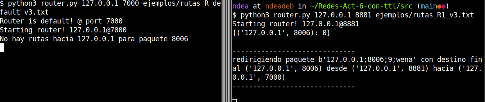

# Forwarding basico

> Autor: Joaquin Lopez

## Codigo y desiciones

En la carpeta [src](./src) esta todo el codigo, el cual se divide en
- router.py -> para crear routers
- utils.py  -> el cual tiene la funciones para los packets
- prueba_router.py -> el cual tiene la prueba para los routers de el test 3 con TTL

Los ejemplos usados estan en la carpeta [ejemplos](./src/ejemplos)

Este informe se divide en 2 partes:

1. Sin TTL
2. Con TTL

Los tests son los mencionados en el EOL y se realizaran en el mismo orden

### Round robin

Lo que se hizo para implementar round-robin fue:
Para un mensaje que llega hacia el puerto `p` en la direccion `d`
1. Extraigo en mi tabla de ruta la lista (en el orden dado por la tabla) de todos los routers que tienen a `p` en su rango
2. Si esta lista no es vacia: 
    - Lo guardo en un cache si es la primera vez que lo visito, con el valor 0 y con llave el par (direccion `d`, puerto `p`) el cual quiero visitar y visito el primer elemento de la lista.
    - Si no es la primera vez, entonces obtengo el valor, lo aumento en 1 y le tomo el modulo el largo de la lista y acceso a ese valor de la lista.

Notemos que siempre va escoger un valor distinto si hay varios caminos.

## Sin TTL

### 1. Rutas mal formadas, ejemplo 2

Si iniciamos los 3 routers, lo que esperariamos con el cambio propuesto al router 2

```
127.0.0.1 8881 8881 127.0.0.1 8881
127.0.0.1 8883 8883 127.0.0.1 8881
```

Es que si yo envio un mensaje, del R1 al R3, este nunca llegaria, ya que entraria en un loop infinito
entre el R1 y R2, pero si envio un mensaje del router 3 al 1, este llegaria. Y esto es lo que podemos ver si iniciamos los routers con las tablas


### 2. Probando los paquetes de R1 a R5

Se corrio el codigo 5 veces donde se observaron las siguientes rutas:

```
1) 1->2->3->2->4->5
2) 1->2->3->5
3) 1->2->4->5
4) 1->2->4->2->3->5
5) 1->2->3->2->4->5
```

Notemos que este resultado tiene sentido con el algoritmo, ya que siempre tendremos que pasar por R2 y por lo tanto, de dos podemos bifurcar a R4 o R3 y de ahí, como ambos estan conectado con el R5, tomaran ese camino.

Cabe destacar algo importante, que en la tabla 4 falta un entry el cual es 

```
127.0.0.1 8885 8885 127.0.0.1 8882
```

ya que así, sí podemos llegar a 8885 desde 8882.


### 3. Probando las rutas extra

Aqui haremos lo mismo pero con una ejecucion(los caminos son largos)

```
1->2->0->2->1->0->1->2->3->2->4->5
```

Lo que podemos ver es que los caminos ciclan bastante, pero el algoritmo de round robin permite llegar
eventualmente al 5

En general se modificaron bastante archivos de las tablas de rutas, estas están en la carpeta [prueba3-sinttl](./src/ejemplos/prueba3-sinttl/), se agregaron los routers 0 y 6 y se modficaron los demas para contar la conexion a esos routers.

Aqui van dos ejemplos de tablas de rutas

```
# rutas_R0_v3.txt
127.0.0.1 8881 8886 127.0.0.1 8882
127.0.0.1 8881 8886 127.0.0.1 8881
```

```
# rutas_R2_v3.txt
127.0.0.1 8880 8881 127.0.0.1 8880
127.0.0.1 8880 8881 127.0.0.1 8881
127.0.0.1 8880 8881 127.0.0.1 8883
127.0.0.1 8880 8881 127.0.0.1 8884
127.0.0.1 8880 8881 127.0.0.1 8886
127.0.0.1 8883 8886 127.0.0.1 8880
127.0.0.1 8883 8886 127.0.0.1 8881
127.0.0.1 8883 8886 127.0.0.1 8883
127.0.0.1 8883 8886 127.0.0.1 8884
127.0.0.1 8883 8886 127.0.0.1 8886
```

### 4. Router default

Lo que se decidio hacer es, ya que el router default, 'defaultea' a cualquier otro puerto que no sea de la red
entonces, basta con tomar todos los puertos que no estan entre 8881 y 8885, ie, el complemento.

agregando al final de cada tabla las lineas

```
127.0.0.1 1 8880 127.0.0.1 7000
127.0.0.1 8886 9999 127.0.0.1 7000
```

Donde se puede ver la ejecucion esperada.


## Con TTL

### 1. Rutas mal formadas, ejemplo 2

El mismo ejemplo mencionado anteriormente con la tabla de ruta erronea, solo que ahora como tenemos un ttl
no esperamos un bucle infinito, ya que eventualmente ocurrira que `ttl==0` y por lo tanto descartamos el mensaje.
En particular lo que se observa es que el paquete rebota 5 veces por cada router y luego se descarta

### 2 y 3. Enviando varios datos

Ahora enviamos el siguiente archivo, con los headers y a la direccion `"127.0.0.1;8885;10" "127.0.0.1" "8881"`

```
lo que importa realmente
es que el orden de estas lineas
deben de conservarse 
si esto fuese una aplicacion
de capa 4
Pero estamos en capa 3
asi que
que llegue en el orden [REDACTED] que quiera xddddddddddddddddd
saludines bonitos uwu
owowowowowowowowowowowowowo
```

En el primer envio podemos notar que ya hay un cambio en el orden, al parecer la linea, "si esto fuese una aplicacion"
dio mas de 10 vueltas en la red y por eso se acabo el ttl

```
lo que importa realmente
es que el orden de estas lineas
deben de conservarse
de capa 4
Pero estamos en capa 3
asi que
que llegue en el orden [REDACTED] que quiera xddddddddddddddddd
saludines bonitos uwu
owowowowowowowowowowowowowo
Se recibio un packete con ttl 0 Packet(ip='127.0.0.1', port=8885, ttl=0, msg=b'si esto fuese una aplicacion')
```

Despues para una ejecucion mas el orden queda mucho mas disperso:

```
es que el orden de estas lineas
lo que importa realmente
si esto fuese una aplicacion
de capa 4
deben de conservarse
asi que
Pero estamos en capa 3
que llegue en el orden [REDACTED] que quiera xddddddddddddddddd
owowowowowowowowowowowowowo
saludines bonitos uwu
```